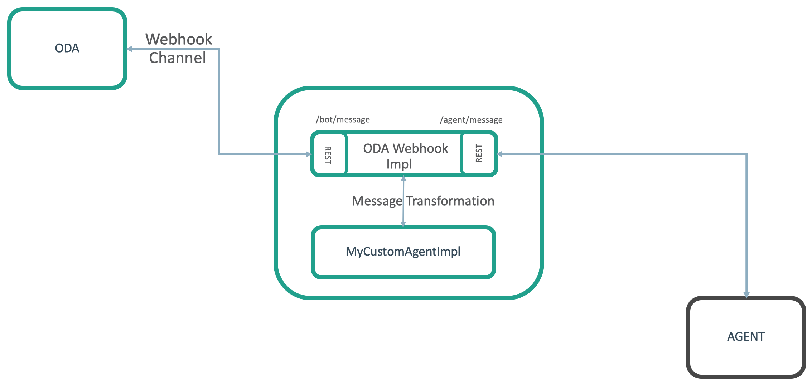

# Integrating Oracle Digital Assistant (ODA) with an Agent System

This project allows ODA (19.1.3 and above) to handover a user chat to a third party Agent Handover system other than Oracle Service Cloud.
Project is shipped with mock agent server 'with no UI' that prints out user messages to console. Also a sample implementation to hand over chat to "Oracle Engagement Cloud (19A or above)".

## Features

This project extends ODA out of the box features integrating with Oracle Service Cloud to different agent systems, so you will still use the out of the box **System.AgentInitiation** and **System.AgentConversation** components; hence your skill is totally abstracted from back-end agent system details. By using ODA built-in system components, the following features are supported:

* Passing user **conversation history** to agent upon initiating a chat request.
* Bot user can terminate chat conversation at anytime using the exit keywords specified in **System.AgentConversation** component.
* Upon terminating a chat conversation, Agent can redirect the bot to a specific state as specified in the actions property in **System.AgentInitiation** component.
* Upon terminating a chat conversation, Agent can decide to automatically add a new utterance to an intent.

## High level architecture

As described in the below screenshot, this integration uses ODA webhook channel to pass user messages to webhook implementation, webhook implementation calls out your custom agent implementation file that is basically responsible for message transformations between ODA and agent system, and then message sent to agent or ODA depending from where the message originated.



## Install

* Clone project repository `git clone git@github.com:oracle/cloud-asset-oda-agent-handover.git`
* Navigate to project directory `cd cloud-asset-oda-agent-handover` and install required libraries `npm install`
* Edit `cloud-asset-oda-agent-handover/config/config.js` and update ODA webhook details as specified in section [Configure ODA Skill](#Configure-ODA-Skill). Also you need to update **AGENT_IMPL_FILE**, For more details check [Integrate with a third party agent system](#Integrate-with-a-third-party-agent-system)

```js
// Digital Assistance Webhook channel details
module.exports.DA_WEBHOOK_URL = "ODA_WEBHOOK_URL";
module.exports.DA_WEBHOOK_SECRET = "ODA_WEBHOOK_SECRET";

// Webhook Implementation
module.exports.PORT = process.env.PORT || 4444;

/**
 * Name of the agent implementation file without the extension.
 * This file exists under oda_agent_handover/src/agentImpl folder
 */
module.exports.AGENT_IMPL_FILE = "mockAgent";  

```

* Run webhook using `npm start` or `npm run start:dev` the later will start server in development mode with code live reload enabled using nodemon and inspect mode on port 9229 for debugging.
* If you make code changes, you can run `npm run lint:fix` to lint your code using eslint.
* If you are running locally on your laptop, you need to expose your webhook to the internet through an SSL connection. For development purposes, you can using ngrok `ngrok http 4444`


## Configure ODA Skill

* Create a new Skill for example **AgentFramework** and replace the generated BOTML with the following sample:

```yaml
metadata:
  platformVersion: "1.1"
main: true
name: AgentFramework
context:
  variables:
    question: "string"
    myCustomProps: "string"

states:
  setUserEmail:
    component: "System.SetVariable"
    properties:
      value: "CHANGE_TO_YOUR_EMAIL"
      variable: "profile.email"
    transitions: {}
    
  setUserFirstName:
    component: "System.SetVariable"
    properties:
      value: "CHANGE_TO_YOUR_FIRST_NAME"
      variable: "profile.firstName"
    transitions: {}
    
  setUserLastName:
    component: "System.SetVariable"
    properties:
      value: "CHANGE_TO_YOUR_LAST_NAME"
      variable: "profile.lastName"
    transitions: {}
    
  setCustomProperties:
    component: "System.SetVariable"
    properties:
      variable: "myCustomProps"
      value:
        Product: 
          - Name: "Product X"
            Serial: "CUSTOM_PRODUCT_SERIAL_NUMBER"
        Country: 
          - City: "MY_CITY"
            Code: "MY_COUNTRY"
        Profile: 
          - mobileNumber: "CHANGE_TO_YOUR_MOBILE_NUMBER"
            userName: "CHANGE_TO_ANY_USER_NAME"

  start:
    component: "System.Text"
    properties:     
      prompt: "How can I help you?"
      variable: "question"
    
  startContactAgent:
    component: "System.AgentInitiation"
    properties:
      subject: "${question}"
      agentChannel: "AgentFrameworkChannel"
      agentActions: "MyAction,Payments"
      waitingMessage: "Chat accepted, waiting for agent to join"
      rejectedMessage: "Apologies no agent is available at the moment"
      customProperties: "${myCustomProps.value}"
    transitions:
      actions:
        accepted: "agentConversation"
        rejected: "rejected"
        
  agentConversation:
    component: "System.AgentConversation"
    properties:
      agentChannel: "AgentFrameworkChannel"
      exitKeywords: "bye,thanks,thank you"
      conclusionMessage: "Agent left the conversation, we will redirect you back again to our automated bot."
    transitions:
      actions:
        MyAction: "agentRedirection"
        Payments: "agentRedirection"
      next: "exit"
      
  agentRedirection:
    component: "System.Output"
    properties:
      text: "Agent left conversation and redirected you to this state."
      keepTurn: false
    transitions:
      next: "exit"
      
  rejected:
    component: "System.Output"
    properties:
      text: "Agent Rejected chat request."
      keepTurn: true
      
  exit:
    component: "System.Output"
    properties:
      text: "End of Agent Handover demo."
    transitions:
      return: "start"
```

* Create a new channel and point it to your webhook implementation URL `https://ADDRESS:PORT/bot/message` If you are using ngrok to expose your webhook implementation, then the that URL would be `https://NGROK_URL/bot/message`
* As mentioned in **[step (3)](#Install)** in the installation section, update the **ODA_WEBHOOK_URL** and **ODA_WEBHOOK_SECRET** to map to the details of  the newly created channel.
* Route new channel to your skill.
* Note down the channel name, and then back to your skill BOTML, update the **System.AgentInitiation** component in state **startContactAgent** and make sure that **agentChannel** property is set to the name of your channel you created. Apply the same for the **System.AgentConversation** component in state **agentConversation**

```yaml
  startContactAgent:
    component: "System.AgentInitiation"
    properties:
      subject: "${question}"
      agentChannel: "AgentFrameworkChannel"
      agentActions: "MyAction,Payments"
      waitingMessage: "Chat accepted, waiting for agent to join"
      rejectedMessage: "Apologies no agent is available at the moment"
      customProperties: "${myCustomProps.value}"
    transitions:
      actions:
        accepted: "agentConversation"
        rejected: "rejected"

  agentConversation:
    component: "System.AgentConversation"
    properties:
      agentChannel: "AgentFrameworkChannel"
      exitKeywords: "bye,thanks,thank you"
      conclusionMessage: "Agent left the conversation, we will redirect you back again to our automated bot."
    transitions:
      actions:
        MyAction: "agentRedirection"
        Payments: "agentRedirection"
      next: "exit"
```

* To ensure conversation history is passed along, make sure to enable conversation logging.


## Payloads

Below are the details of the message formats exchanged between the webhook implementation and agent server.

### From Webhook to Agent

All messages sent from Webhook to agent system will pass a botUser object. This identifies the user conversation session in ODA. Agent system should store this object and send it back along will all messages to webhook. ODA will use this value to properly route messages to the correct user conversation session.

1. **Request chat**: sent when a user request chat with an agent.

    ```json
    {
      "botUser": {
          "userId": "3281467"
      },
      "conversationHistory": [
        {
          "payload": "start",
          "id": "5d59878d-b451-4dca-b348-bab296a8d896",
          "source": "USER",
          "createdOn": 1552039641121
        },
        {
          "payload": "How can I help you?",
          "id": "ba910a5a-74f9-41bb-8b31-222c3384de5d",
          "source": "BOT",
          "createdOn": 1552039641205
        },
        {
          "payload": "I want to speak with an agent",
          "id": "407aa4b5-7c40-4ff0-a1b4-3ec5d24e7cd6",
          "source": "USER",
          "createdOn": 1552039647643
        }
      ],
      "actions": [
        {
          "action": "MyAction",
          "description": "MyAction",
          "label": "MyAction"
        },
        {
          "action": "Payments",
          "description": "Payments",
          "label": "Payments"
        }
      ],
      "firstName": "CHANGE_TO_YOUR_FIRST_NAME",
      "lastName": "CHANGE_TO_YOUR_LAST_NAME",
      "email": "CHANGE_TO_YOUR_EMAIL",
      "message": "I want to speak with an agent",
      "metadata": {
        "Country": [
          {
            "City": "MyCity",
            "Code": "MyCountry"
          }
        ],
        "MyProduct": [
          {
            "Serial": "CUSTOM_PRODUCT_SERIAL_NUMBER",
            "Name": "Product X"
          }
        ],
        "Profile": [
          {
            "mobileNumber": "CHANGE_TO_YOUR_MOBILE_NUMBER",
            "userName": "CHANGE_TO_ANY_USER_NAME"
          }
        ]
      }  
    }
    ```

    **conversationHistory**: an array containing the full conversation history between user and bot. It is the agent system responsibility to parse it and outputs a proper interface in agent system.

    **actions**: an array of action objects passed to agent. An agent can use the the value of action.action property to terminate chat with user and redirect bot to a specific state in BOTML. For more details, check section [Agent Action Transition](#From-Agent-to-Webhook).

    **metadata**: a JSON object holding custom properties, this maps to the **customProperties** property in **System.AgentInitiation** state. Basically this is any custom metadata that can be passed along chatRequest.

2. **Send Chat** Message: user sends a chat message to agent during an ongoing conversation.

    ```json
    {
      "botUser": {
        "userId": "3246969"
      },
      "message": "This is a message from bot to agent",
      "sessionId": "123456"
    }
    ```

    **sessionId**: a unique value that identifies user chat session in agent system. This is a value passed from agent system upon accepting a chat request. For more details, check section [Chat Accepted](#From-Agent-to-Webhook).

3. **Terminate Chat**: user terminates chat conversation with an agent by sending any of the exit key words defined in **System.AgentConversation** component in stat **agentConversation**

    ```json
    {
      "botUser": {
        "userId": "3246969"
      },
      "message": "terminate chat from bot",
      "sessionId": "123456"
    }
    ```

    **sessionId**: a unique value that identifies user chat session in agent system. This is a value passed from agent system upon accepting a chat request. For more details, check section [Chat Accepted](#From-Agent-to-Webhook).

### From Agent to Webhook

Agent back-end system, must **POST** responses to webhook implementation on `https://WEBHOOK_ADDRESS:PORT/agent/message`

All messages sent from Agent system to webhook will pass a **sessionId** property. This identifies the user conversation session in agent system. Webhook implementation will store this property and send it back along will all messages to agent system. Agent system will use this property to properly route messages to the correct user conversation session.

1. **Request chat Accepted**: sent when agent accepts a user chat request.

    ```json
    {
      "type": "accepted",
      "payload": {
        "message": "Hello my name is Agent, how can I help you?",
        "sessionId": "123456",
        "botUser": {
          "userId": "3246969"
        }
      }
    }
    ```

    **botUser**: the user ID in ODA, for more details check section [From Webhook to Agent](#From-Webhook-to-Agent).

2. **Request chat Delayed**: sent when when user chat request is pending in queue waiting for an agent to pick it up.

    ```json
    {
      "type": "delayed",
      "payload": {
          "message": "Our agents are busy serving others, your waiting time is 15 mins",
          "botUser": {
            "userId": "3246969"
          }
        }
    }
    ```

    **botUser**: the user ID in ODA, for more details check section [From Webhook to Agent](#From-Webhook-to-Agent).

3. **Request chat Rejected**: sent when agent reject a user chat request.

    ```json
    {
      "type": "rejected",
      "payload": {
        "message": "sorry, you contacted us out of office hours",
        "botUser": {
            "userId": "3246969"
        }
      }
    }
    ```

    **botUser**: the user ID in ODA, for more details check section [From Webhook to Agent](#From-Webhook-to-Agent).

4. **Send Chat message**: agent sends a chat message to user during an ongoing conversation.

    ```json
    {
      "type": "agent",
      "payload": {
        "message": "Hello my name is Agent, how can I help you?",
        "sessionId": "123456",
        "botUser": {
            "userId": "3246969"
        }
      }
    }
    ```

    **botUser**: the user ID in ODA, for more details check section [From Webhook to Agent](#From-Webhook-to-Agent).

5. **Terminate Chat**: agent terminates chat conversation with a user.

    ```json
    {
      "type": "agentLeft",
      "payload": {
      "message": "Thanks for contacting us, you will be redirected back to bot",
        "sessionId": "123456",
        "botUser": {
          "userId": "3246969"
        }
      }
    }
    ```

    **botUser**: the user ID in ODA, for more details check section [From Webhook to Agent](#From-Webhook-to-Agent).

6. **Agent Action Transition**: agent terminates chat conversation with a user and redirects bot to a specific state as specified in the action property. For more details check section [Request Chat](#From-Webhook-to-Agent).

    ```json
    {
      "type": "agentAction",
      "payload": {
          "action": "Payments",
          "sessionId": "123456",
          "botUser": {
              "userId": "3246969"
          }
      }
    }
    ```

    **botUser**: the user ID in ODA, for more details check section [From Webhook to Agent](#From-Webhook-to-Agent).

7. **Agent Action Learn**: agent terminates chat conversation with a user and add an utterance to an intent. Format is `learn INTENT_NAME, SAMPLE_UTTERANCE`

    ```json
    {
      "type": "agentAction",
      "payload": {
          "action": "learn Payment, pay my bills",
          "sessionId": "123456",
          "botUser": {
            "userId": "3246969"
          }
      }
    }
    ```

    **botUser**: the user ID in ODA, for more details check section [From Webhook to Agent](#From-Webhook-to-Agent).

## Start Agent Mock Server

By default, project is configured with a mock agent server that outputs messages to console. To start server run `npm run mock-server` this starts a nodeJS server on port 4445. To use a different agent system, follow the steps in section [Integrate with a third party agent system](#Integrate-with-a-third-party-agent-system)

### Using Agent Mocker Server

* Follow steps in [Install section](#Install)
* Follow steps in [Configure ODA Skill section](#Configure-ODA-Skill)
* Run mock server using `npm run mock-server`
* Start a conversation from ODA skill tester.
* Upon receiving a chat request, mock-server console will outputs the following message

    ```bash
    Received chat request, payload is: { botUser: { userId: '9289908' },
  conversationHistory:
   [ { payload: 'start',
       id: 'b29e4050-0fe2-4067-9747-51492bb22113',
       source: 'USER',
       createdOn: 1552232161095 },
     { payload: 'How can I help you?',
       id: '2168b148-07a9-4cf5-9b5a-10741e6da97e',
       source: 'BOT',
       createdOn: 1552232161183 },
     { payload: 'I want to speak with an agent',
       id: '3fb63125-b912-4f18-98b8-5c4231f497fb',
       source: 'USER',
       createdOn: 1552232164203 } ],
  actions:
   [ { action: 'MyAction',
       description: 'MyAction',
       label: 'MyAction' },
     { action: 'Payments',
       description: 'Payments',
       label: 'Payments' } ],
  firstName: 'CHANGE_TO_YOUR_FIRST_NAME',
  lastName: 'CHANGE_TO_YOUR_LAST_NAME',
  email: 'CHANGE_TO_YOUR_EMAIL',
  message: 'I want to speak with an agent' }
    ````

* **POST** a **ChatAccepted** or **ChatDelayed** response as specified in [From Agent to Webhook section](#From-Agent-to-Webhook) make sure to copy **botUser** object from mock server console and use it within your payload. Note that a dummy **sessionId** is used with the value of **12345**.

    ```bash
    curl -X POST \
  http://localhost:4444/agent/message \
  -H 'Content-Type: application/json' \
  -d '{
        "type": "accepted",
        "payload": {
          "message": "Hello my name is Agent, how can I help you?",
          "sessionId": "123456",
          "botUser": {
              "userId": "9289908"
          }
        }
      }'
    ```
* After accepting a chat request you can send any of the supported payloads as specified in section [From Agent to Webhook](#From-Agent-to-Webhook).

## Integrate with a third party agent system

By default, project is configured to work with a sample agent mock server. Both mock server and webhook implementation assumes the [the following payloads](#Payloads) to be exchanged. In reality, it is not always possible to customize the backend agent system to accommodate these formats. Hence you need to do message transformation in between.

To add a new implementation to your agent system, you need to create an implementation file under `cloud-asset-oda-agent-handover\src\agentImpl` for example `MyAgentImpl.js` and then specify the name of that file in the config file as mentioned in the [installation section](#Install). If you created your agent implementation file inside a new folder for example `cloud-asset-oda-agent-handover\src\agentImpl\myFolder\MyAgentImpl.js`, then you need to specify the name of that folder too, for example `module.exports.AGENT_IMPL_FILE = "/myFolder/MyAgentImpl";`. Your agent implementation must conforms with a specific structure,a sample is shipped in same folder `mockAgent.js`.

```javascript
// Agent API Base URL
const AGENT_API_BASE_URL = "http://localhost:4445/agent/api/chat/v1/";

const log4js = require("log4js");
const logger = log4js.getLogger("AgentImpl");
logger.level = "debug";

class MockAgent {
    constructor() {

    }

    /**
     * Transform a message payload from webhook structure to Agent structure. 
     * @returns {object} agent message
     * @param {object} payload : Message Payload to send to agent, you need to transform to agent message payload.
     * @param {string} payloadType : Flag to indicate the payload type. Allowed values are requestChat|concludeChat|postMessage
     */
    async toAgentPayloadStructure(payload, payloadType) {
        try {
            switch (payloadType) {
            case "requestChat":
            {
                // Transform payload to agent requestChat payload
                break;
            }
            case "concludeChat":
            {
                // Transform payload to agent terminateChat payload
                break;
            }
            case "postMessage":
            {
                // Transform payload to agent postChat payload
                break;
            }
            }
            return payload;
        } catch (error) {
            logger.error("Error transforming payload from ODA format to agent format, detailed error: %s", error.message);
            throw new Error(error);
        }
    }


    /**
     * Transform a message payload from Agent structure to webhook payload structure.
     * @returns {object} ODA Message payload
     * @param {string} payload : Agent message payload to transform to ODA format
     */
    async fromAgentPayloadStructure(payload) {
        try {
            return payload;
        } catch (error) {
            logger.error("Error transforming payload from agent format to ODA format, detailed error: %s", error.message);
            throw new Error(error); 
        }
    }

    /**
     * Build an axios config body as documented in https://github.com/axios/axios that will be used for the REST call to agent API.
     * @returns {object} an axios config body.
     * @param {object} payload : Payload to send to agent API.
     * @param {string} payloadType : Flag to indicate the payload type. Allowed values are requestChat|concludeChat|postMessage. payloadType can be used to determine the appropriate Agent API endpoint to call.
     */
    async buildRestCallPayload(payload, payloadType) {

        try {
            let request = {
                method: "POST", // HTTP method
                data: payload, // method body
                url: AGENT_API_BASE_URL + payloadType,
                responseType: "json",
            // validateStatus: function (status) {
            //     return (status >= 200 && status < 300) // Default
            // },
            // headers: { // Agent API headers
            //     "X-Custom-Header": "foobar",
            //     "X-Custom-Header2": "foobar2",
            // },
            // auth: {
            //     username: "AgentUser", // Agent API userName
            //     password: "mypassword" // Agent API Password
            // },
            // proxy: {
            //     host: "127.0.0.1", // Proxy Server Address
            //     port: 8080, // Proxy Server Port
            //     auth: {
            //         username: "PROXY_USER", // Proxy Server UserName
            //         password: "myPassword" // Proxy Server Password
            //     }
            // }
            };
            return request;
        } catch (error) {
            logger.error("Error building rest call payload to agent, detailed error: %s", error.message);
            throw new Error(error);
        }
    }

    /**
     * Result of calling "buildRestCallPayload" are passed to this method
     * @param {object} payload : The payload sent by "buildRestCallPayload" method to Agent.
     * @param {object} result : The result of calling "buildRestCallPayload" method if any.
     * @param {string} payloadType : Flag to indicate the payload type. Allowed values are requestChat|concludeChat|postMessage. payloadType can be used to determine the appropriate Agent API endpoint to call.
     * @param {number} statusCode: HTTP Response Code for calling the REST end point
     */
    async restCallResult(payload, result, payloadType, statusCode) {
        try {
            // Do something with result if needed
        } catch (error) {
            logger.error("Error processing agent rest call result, detailed error: %s", error.message);
            throw new Error(error);
        }
    }
}
module.exports = MockAgent;
```

* **toAgentPayloadStructure**: in this method you convert payloads from the default webhook implementation structure as specified in section [From Webhook to agent](#From-Webhook-To-Agent) to agent specific payload structure. The method is passed two parameters, the actual payload and a payloadType.
  * **payload** is one of the payloads defined in section [From Webhook to agent](#From-Webhook-To-Agent)
  * **payloadType** is a string value indicating the type of payload, it is one of the following values **requestChat, concludeChat, postMessage**. You use this value as a control flag to differentiate between the different payloads generated from webhook and then convert to the appropriate corresponding agent payload structure. Method must return the transformed payload.

* **fromAgentPayloadStructure**: in this method you convert payloads from agent structure to webhook implementation structure as specified in section [From Agent to Webhook](#From-Agent-to-Webhook). This method is passed a **payload** property which is the raw JSON object as received from agent post back call. It is the the developer responsibility to understand the  payload structures sent from agent system and differentiate between them and then transform to the corresponding structure as specified in section [From Agent to Webhook](#From-Agent-to-Webhook). Method must return the transformed payload.

* **buildRestCallPayload**: This method generates the axios config body to execute. Webhook implementation uses [axios](https://github.com/axios/axios) as an HTTP client to invoke REST calls on agent system. The method is passed two parameters, the **_transformed_** payload and a payloadType. 
  * **payload** is the **_transformed_**  payload generated by **_toAgentPayloadStructure_** method.
  * **payloadType** is a string value indicating the type of payload, it is one of the following values **requestChat, concludeChat, postMessage**. If agent system exposes different endpoints to handle different actions -for example the endpoint to receive a chatRequest is different from the endpoint to receive a chatMessage - you can use the **payloadType** property to differentiate between the payloads and consequently call the correct endpoint.
  
  If your agent system requires authentication, specific header params or behind a proxy, you can un-comment the corresponding properties and update as needed. Note that an axios config body supports many other properties, for complete list visit [axios documentation page on github](https://github.com/axios/axios)

* **restCallResult**: This method is passed the result of calling **buildRestCallPayload**
  * **payload** is the **_transformed_**  payload generated by **_toAgentPayloadStructure_** method and sent to to agent.
  * **result** is the result of sending the payload to agent.
  * **payloadType** is a string value indicating the type of payload, it is one of the following values **requestChat, concludeChat, postMessage**. If agent system exposes different endpoints to handle different actions -for example the endpoint to receive a chatRequest is different from the endpoint to receive a chatMessage - you can use the **payloadType** property to differentiate between the payloads and consequently do different actions.

## Integrate with Oracle Engagement Cloud (19A or above)

1. Edit `cloud-asset-oda-agent-handover/config/config.js` and set the value of **module.exports.AGENT_IMPL_FILE** to **engagementCloud**

    ```javascript
    /**
    * Name of the agent implementation file without the extension.
    * This file exists under oda_agent_handover/src/agentImpl folder
    */
    module.exports.AGENT_IMPL_FILE = "/engagementCloud/engagementCloud";
    ```

2. Edit `cloud-asset-oda-agent-handover/src/agentImpl/engagementCloud/ecUtils.js` and change values as needed. Note that you need to properly secure this file as it will contains your instance username/password.

    ```javascript
    // EC Base URL, for example https://myEcInstance.mydomain.com
    module.exports.EC_URI = "https://myEcInstance.mydomain.com";

    // FA user Credentials (service user) that has access to "EC chat consumer APIs"
    module.exports.CREDENTIALS_FA_SERVICE_USER = "USER_NAME";
    module.exports.CREDENTIALS_FA_SERVICE_USER_PASSWORD = "PASSWORD";

    // Default Authenticate Chat properties, for details check section (3. Authenticate explained here https://docs.oracle.com/en/cloud/saas/engagement/19b/facoe/c_chat_quick_start.html)
    // Note: You can only (optionally) change the below values.
    module.exports.CHAT_AUTHENTICATE_INTERFACE_ID = 1;
    module.exports.CHAT_AUTHENTICATE_QUEUE_ID = 1;
    module.exports.CHAT_AUTHENTICATE_PRODUCT_ID = null;
    module.exports.CHAT_AUTHENTICATE_INCIDENT_ID = null;
    module.exports.CHAT_AUTHENTICATE_INCIDENT_TYPE = null;
    module.exports.CHAT_AUTHENTICATE_RESUME_TYPE = "RESUME";
    module.exports.CHAT_AUTHENTICATE_MEDIA_LIST = "CHAT";

    // Default Polling time (in milliseconds) to get new messages from Engagement Cloud. Default value is 3 seconds
    //                       convert to milliseconds * seconds
    module.exports.CHAT_LISTENER_POL_INTERVAL = 1000 * 3;
    ```

3. run webhook by executing `npm start`

# Contributing

`cloud-asset-oda-agent-handover` is an open source project. See [CONTRIBUTING](CONTRIBUTING.md) for details.

Oracle gratefully acknowledges the contributions to `cloud-asset-oda-agent-handover` that have been made by the community.

# Considerations

This is project is intended to be a sample and not an official extension to be used in production systems. For example, the implementation uses an in-memory cache to store metadata that is used by the implementation. It is possible to use an external full fledged database, for that you need to customize `cloud-asset-oda-agent-handover/src/lib/userStore/impl/UserStore.js`. However for the sake of simplicity and demo purposes, an in-memory cache store is used.